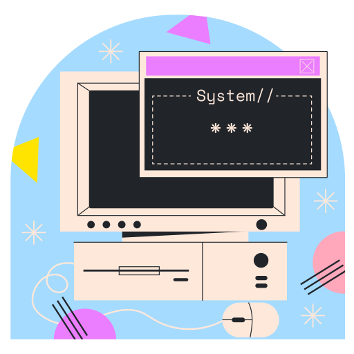

# workstation



Personal workstation bootstrap playbook.

[![Works every time][wet]][ftb] [![Built with resentment][btr]][ftb]

[wet]: https://forthebadge.com/images/badges/60-percent-of-the-time-works-every-time.svg
[btr]: https://forthebadge.com/images/badges/built-with-resentment.svg
[ftb]: https://forthebadge.com


## About

This playbook expects a fresh Manjaro-with-KDE installation. Much of it will
work as expected in other Arch-based distributions, as well on other desktop
environments (xfce, lxde, i3 etc). Some things, however, are very KDE-specific.

`workstation` makes use of:

- [`dots`][dots-url], my collection of *NIX configuration files
- [`bin`][bin-url], my collection of scripts, utilities, hacks, [...]

[dots-url]: https://github.com/caian-org/dots
[bin-url]: https://github.com/caian-org/bin


## Usage

```sh
curl -fsSL https://git.io/fjcFh | bash
```


## Acknowledgements

`workstation` is highly inspired (by functionality or implementation) on these
projects/scripts:

- [`setup`][setup] by [Gabriel Tiossi][tioxy]
- [`my_workstation`][mywst] by [Diego Paludo][dpaludo]

Icons made by [Eucalyp][eucalyp] from [Flaticon][flaticon] is
licensed by [CC 3.0 BY][cc3].

[setup]: https://github.com/tioxy/setup
[mywst]: https://github.com/diegopaludo/my_workstation

[tioxy]: https://github.com/tioxy
[dpaludo]: https://github.com/diegopaludo

[eucalyp]: https://www.flaticon.com/authors/eucalyp
[flaticon]: https://www.flaticon.com
[cc3]: http://creativecommons.org/licenses/by/3.0


## License

To the extent possible under law, [Caian Rais Ertl][me] has waived __all
copyright and related or neighboring rights to this work__. In the spirit of
_freedom of information_, I encourage you to fork, modify, change, share, or do
whatever you like with this project! [`^C ^V`][kopimi]

[![License][cc-shield]][cc-url]

[me]: https://github.com/caiertl
[cc-shield]: https://forthebadge.com/images/badges/cc-0.svg
[cc-url]: http://creativecommons.org/publicdomain/zero/1.0

[kopimi]: https://kopimi.com
